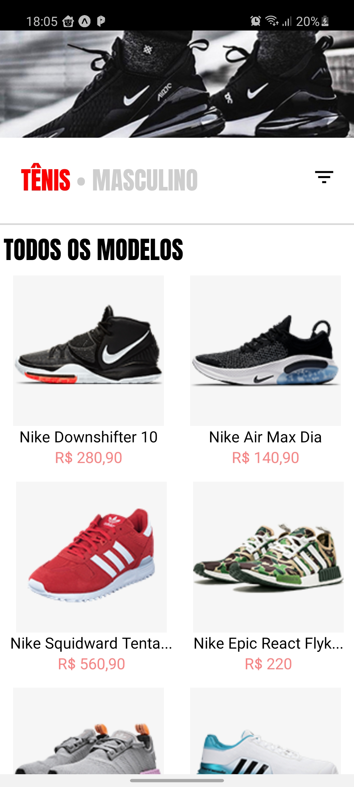
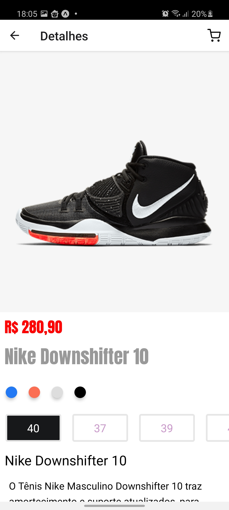
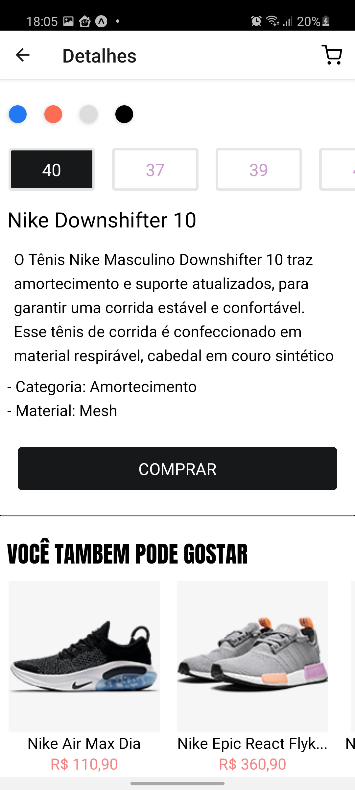

# Shop Shoes React Native

> Example of a shoe store with only two pages Home and product details made with React Native

<div align="center">
  <sub>Linkedin
    <a href="https://www.linkedin.com/in/jo%C3%A3o-domingos-ab39021b0">João Domingos</a>
  </sub>
</div>

### Screenshot
<div style="display: flex; flex-direction: 'row';">
   
   
   
</div>

# :computer: Technology
This project was made using the following technologies:

* [React Native](https://reactnative.dev/)      
* [Expo](https://expo.io/)       

# :rocket: Functionalities

* Homepage: Products presentation.
* Details page: Product details.

### 📱 Run Project
To run the project you need a cell phone with the [expo](https://play.google.com/store/apps/details?id=host.exp.exponent) installed or an android/ios emulator.

```bash
# Go to the project folder
$ cd shop-shoes

# Install the dependencies
$ yarn install

# Run the application
$ expo start
```
Then read the QR Code with the app [expo](https://play.google.com/store/apps/details?id=host.exp.exponent) or run on an emulator.
